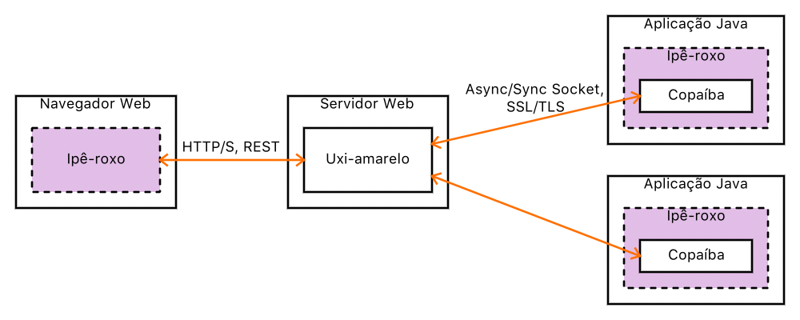

# Ipê-roxo Web (Front-End)

Modelo de aplicação Web para execução em navegador ou [Cordova](https://cordova.apache.org/), baseado em HTML, CSS e JavaScript, compondo parte do [Ipê-roxo](https://github.com/joseflaviojr/iperoxo).

## Descrição

A aplicação Web (Front-End) do Ipê-roxo é responsável por disponibilizar e gerenciar a interface de comunicação do usuário com o sistema.

## Versão Atual

1.0-A22 (Fase de Nascimento)

Padrão de versionamento: [JFV](http://joseflavio.com/jfv)

## Instalação

Esta aplicação Ipê-roxo pode ser instalada diretamente em qualquer servidor Web, sem a necessidade de compilação ou de empacotamento. Ela também pode ser incorporada num aplicativo móvel do tipo [Cordova](https://cordova.apache.org/), conforme [instruções específicas](https://github.com/joseflaviojr/iperoxo/tree/master/iperoxo-cordova).

## Estrutura

A aplicação Web Ipê-roxo possui uma estrutura simples de arquivos, a qual é explicada a seguir.

- **css** : estilos CSS específicos da aplicação, normalmente gerados automaticamente a partir de arquivos SASS/SCSS.
- **css-dep** : estilos CSS do núcleo do Ipê-roxo e das bibliotecas de dependência.
- **etc** : arquivos de bases de dados e de finalidade geral.
  - **Mensagens_en.properties** : dicionário em inglês das palavras e frases que são apresentadas na aplicação, aos moldes de [messageformat](https://messageformat.github.io/), sendo parte do recurso de internacionalização.
  - **Mensagens_pt.properties** : equivalente em português do arquivo *Mensagens_en.properties*.
- **fonts** : fontes tipográficas, tais como TTF, EOT e WOFF.
- **html** : arquivos HTML específicos da aplicação, com exceção do **index.html**, que reside no diretório raiz. A maioria dos arquivos HTML é especificada com o intuido de compor parte da página Web, como uma tela, por exemplo, sendo carregada através da função [http://api.jquery.com/load/](http://api.jquery.com/load/).
  - **componentes.html** : definição de componentes visuais específicos para a aplicação.
  - **tela.html** : modelo de tela que contém formulário para envio de dados para processamento através de [Uxi-amarelo](http://joseflavio.com/uxiamarelo).
- **html-dep** : arquivos HTML do núcleo do Ipê-roxo e das bibliotecas de dependência.
- **img** : arquivos de imagem, tais como PNG, JPG e GIF.
- **js** : arquivos JavaScript específicos da aplicação.
  - **aplicacao.js** : script que inicializa e controla o ciclo de vida da aplicação.
  - **configuracao.js** : configurações gerais da aplicação.
- **js-dep** : arquivos JavaScript do núcleo do Ipê-roxo e das bibliotecas de dependência.
  - **iperoxo-componentes.js** : comportamento dos componentes visuais padrões.
  - **iperoxo-dicionario-en.js** : dicionário dinâmico que incorpora as mensagens definidas em */etc/Mensagens_en.properties*.
  - **iperoxo-dicionario-pt.js** : equivalente em português de *iperoxo-dicionario-en.js*.
  - **iperoxo.js** : biblioteca base de objetos e funções JavaScript para o pleno funcionamento das aplicações Ipê-roxo.
- **sass** : arquivos de estilo [Sass](https://sass-lang.com/) específicos da aplicação, os quais são automaticamente convertidos para CSS através do script *servidor.sh*.
- **sass-dep** : arquivos de estilo [Sass](https://sass-lang.com/) do núcleo do Ipê-roxo e das bibliotecas de dependência.
- **WEB-INF** : diretório necessário apenas para servidores Web JavaEE.
- **servidor.sh** : script bash que inicializa o processo de conversão Sass/CSS e o [servidor Web simples](https://docs.python.org/2/library/simplehttpserver.html#module-SimpleHTTPServer) da Python na porta 8000.
- **index.html** : principal arquivo HTML (página inicial), o qual está preparado para aplicações *single page*.
