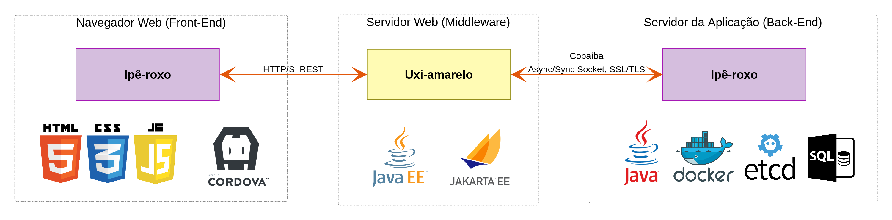

# Ipê-roxo - Aplicação Web

Modelo de aplicação Web para execução em navegador ou [Cordova](https://cordova.apache.org/), baseado em HTML5, CSS3 e JavaScript, compondo parte do [Ipê-roxo](https://github.com/joseflaviojr/iperoxo).

## Descrição

A aplicação Web do Ipê-roxo é responsável por manter a interface de comunicação do usuário com o sistema. No esquema geral do Ipê-roxo (figura abaixo), o módulo "Navegador Web" contém a aplicação Web aqui especificada.

## Versão Atual

1.0-A17

Padrão de versionamento: [JFV](http://joseflavio.com/jfv)

## Instalação

Esta aplicação Ipê-roxo pode ser instalada diretamente em qualquer servidor Web, podendo ser alterada *in loco*.

## Estrutura

A aplicação Web Ipê-roxo possui uma estrutura simples de arquivos, a qual é explicada a seguir.

- **css** : diretório que centraliza os arquivos de estilo CSS especificados para esta aplicação, normalmente gerados automaticamente a partir de arquivos SCSS.
- **css-dep** : diretório que centraliza os arquivos de estilo CSS das bibliotecas que o Ipê-roxo é dependente.
- **fonts** : diretório que centraliza os arquivos de fontes tipográficas, tais como TTF, EOT e WOFF.
- **html** : diretório que centraliza os arquivos HTML, com exceção do **index.html**, que reside no diretório raiz. A maioria dos arquivos HTML é especificada com o intuido de compor parte da página Web, como uma tela ou componente, sendo carregada através da função [http://api.jquery.com/load/](http://api.jquery.com/load/).
  - **tela.html** : modelo de tela que contém formulário para envio de dados para processamento através de [Uxi-amarelo](http://joseflavio.com/uxiamarelo).
- **img** : diretório que centraliza os arquivos de imagem, tais como PNG, JPG e GIF.
- **index.html** : principal arquivo HTML (página inicial), o qual está preparado para aplicações *single page*.
- **js** : diretório que centraliza os arquivos JavaScript.
  - **aplicacao.js** : script que inicializa e controla o ciclo de vida da aplicação.
  - **configuracao.js** : configurações gerais da aplicação.
  - **dicionario_en.js** : dicionário em inglês das palavras e frases que são apresentadas na aplicação, aos moldes de [messageformat](https://messageformat.github.io/), sendo parte do recurso de internacionalização.
  - **dicionario_es.js** : equivalente em espanhol do arquivo *dicionario_en.js*.
  - **dicionario_pt.js** : equivalente em português do arquivo *dicionario_en.js*.
  - **iperoxo.js** : biblioteca base de objetos e funções JavaScript para o pleno funcionamento das aplicações Ipê-roxo. Aconselha-se não modificar este arquivo.
- **js-dep** : diretório que centraliza os arquivos JavaScript das bibliotecas que o Ipê-roxo é dependente.
- **sass** : diretório que centraliza os arquivos de estilo [Sass](https://sass-lang.com/), os quais são automaticamente convertidos para CSS através do script *servidor.sh*.
- **servidor.sh** : script que inicializa o processo de conversão Sass/CSS e o [servidor Web simples](https://docs.python.org/2/library/simplehttpserver.html#module-SimpleHTTPServer) do Python na porta 8000.
- **WEB-INF** : diretório necessário apenas para servidores Web JavaEE.

## Licença

### Português

Direitos Autorais Reservados &copy; 2016-2018 [José Flávio de Souza Dias Júnior](http://joseflavio.com)

Este arquivo é parte de Ipê-roxo - [http://joseflavio.com/iperoxo](http://joseflavio.com/iperoxo).

Ipê-roxo é software livre: você pode redistribuí-lo e/ou modificá-lo
sob os termos da [Licença Pública Menos Geral GNU](https://www.gnu.org/licenses/lgpl.html) conforme publicada pela
Free Software Foundation, tanto a versão 3 da Licença, como
(a seu critério) qualquer versão posterior.

Ipê-roxo é distribuído na expectativa de que seja útil,
porém, SEM NENHUMA GARANTIA; nem mesmo a garantia implícita de
COMERCIABILIDADE ou ADEQUAÇÃO A UMA FINALIDADE ESPECÍFICA. Consulte a
Licença Pública Menos Geral do GNU para mais detalhes.

Você deve ter recebido uma cópia da Licença Pública Menos Geral do GNU
junto com Ipê-roxo. Se não, veja [https://www.gnu.org/licenses/lgpl.html](https://www.gnu.org/licenses/lgpl.html).

### English

Copyright &copy; 2016-2018 [José Flávio de Souza Dias Júnior](http://joseflavio.com)

This file is part of Ipê-roxo - [http://joseflavio.com/iperoxo](http://joseflavio.com/iperoxo).

Ipê-roxo is free software: you can redistribute it and/or modify
it under the terms of the [GNU Lesser General Public License](https://www.gnu.org/licenses/lgpl.html) as published by
the Free Software Foundation, either version 3 of the License, or
(at your option) any later version.

Ipê-roxo is distributed in the hope that it will be useful,
but WITHOUT ANY WARRANTY; without even the implied warranty of
MERCHANTABILITY or FITNESS FOR A PARTICULAR PURPOSE. See the
GNU Lesser General Public License for more details.

You should have received a copy of the GNU Lesser General Public License
along with Ipê-roxo. If not, see [https://www.gnu.org/licenses/lgpl.html](https://www.gnu.org/licenses/lgpl.html).
